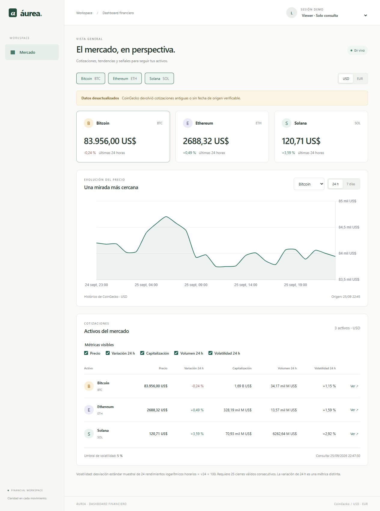
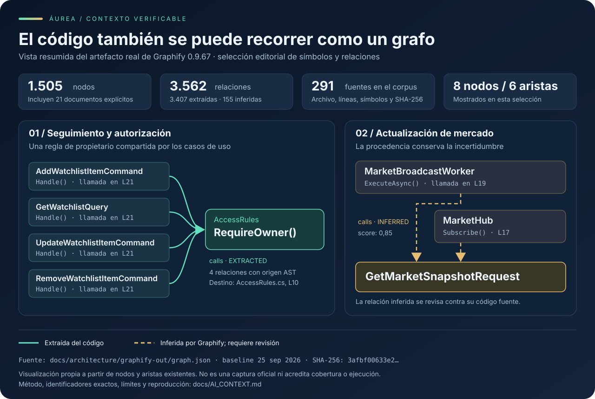
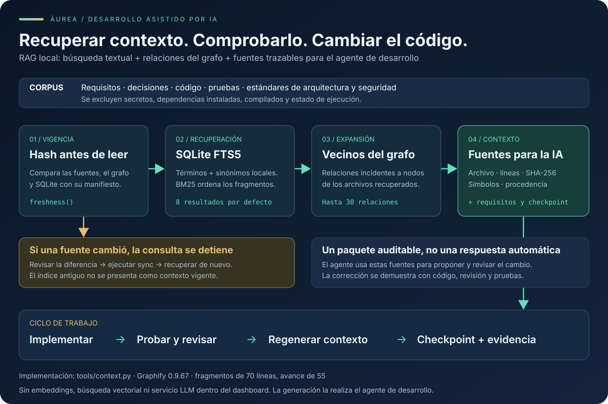

# Áurea · Dashboard financiero con IA aplicada al desarrollo

[](https://github.com/Sebastian2759/aurea-financial-dashboard-ai/actions/workflows/verify.yml)


**Mercado real, permisos verificables y un proceso de desarrollo que conserva sus fuentes.**

Dashboard en español para consultar Bitcoin, Ethereum y Solana en USD/EUR, gestionar seguimiento personal y administrar umbrales, auditoría y registros técnicos. Angular, .NET, SQL Server y SignalR resuelven la aplicación; Graphify y RAG local ayudan a desarrollar y revisar el código con contexto trazable.

**[Instalación detallada](docs/INSTALLATION.md) · [Arquitectura de IA y contexto](docs/AI_CONTEXT.md) · [Prompts y errores reales](AI_PROMPTS.md) · [Evidencia y límites](docs/VALIDATION.md)**



*Captura del despliegue local con Docker y CoinGecko. El aviso de datos desactualizados conserva el estado real de la respuesta; la conexión SignalR activa no convierte una cotización antigua en una nueva.*

## Probar la solución

Necesitas **Docker iniciado, contenedores Linux, equipo x64/amd64 y el plugin Docker Compose con soporte para `--wait`**. Docker Desktop incluye Compose. Como presupuesto práctico, reserva al menos 6 GB de RAM para Docker y espacio para SQL Server, imágenes y compilación. Necesitas Internet durante la instalación y para consultar CoinGecko. La guía explica Windows/WSL 2 y las limitaciones de ARM.

**Para ejecutarla no necesitas instalar Node, .NET, SQL Server ni Python en tu equipo.** Esas dependencias se ejecutan en contenedores; Python solo se utiliza si quieres reproducir el proceso Graphify/RAG.

```sh
git clone https://github.com/Sebastian2759/aurea-financial-dashboard-ai.git
cd aurea-financial-dashboard-ai
```

También puedes descargar **Code → Download ZIP**, extraerlo y abrir una terminal en la carpeta que contiene `compose.yaml`.

**Windows PowerShell:**

```powershell
.\start.ps1
```

**Linux o macOS Intel con Docker disponible:**

```sh
sh start.sh
```

Abre **http://localhost:8080** cuando aparezca `Dashboard listo`. La primera ejecución descarga las imágenes y compila; su duración depende de la conexión y del equipo.

El comando genera `.env` con secretos demo aleatorios, inicia SQL Server, crea la base y aplica migraciones automáticamente, inicia la API y sirve Angular con Nginx. Espera los healthchecks antes de anunciar disponibilidad. **No hay que ejecutar migraciones manualmente.**

Si PowerShell bloquea el script descargado, la [guía de instalación](docs/INSTALLATION.md) explica cómo ejecutarlo y cómo diagnosticar puertos, Docker o errores de descarga. Si conservas el volumen SQL, conserva también `.env`: contiene las credenciales de esa base.

### Datos reales y sesiones de evaluación

La aplicación usa la API pública de **CoinGecko**, sin reemplazar las cotizaciones por simulaciones. La clave Demo es opcional, sujeta a las condiciones y límites del proveedor. Puedes definir `COINGECKO_API_KEY` antes del primer arranque o editar esa variable en `.env` y volver a iniciar. La clave permanece en el backend.

Cuando el proveedor falla, la aplicación conserva el último dato real y señala que está desactualizado; si no dispone de uno, informa un error 503. Las cotizaciones se consultan cada 60 segundos mientras hay clientes suscritos, y los históricos tienen caché de cinco minutos. No se promete un flujo de operaciones bursátiles tick a tick.

**«Sesión demo» se refiere a las identidades de evaluación**, no a los datos financieros. El selector ofrece Viewer, Trader A, Trader B y Admin; no requiere registro ni contraseña. El servidor resuelve el rol y firma un JWT. Para producción se sustituiría este emisor demo por un proveedor de identidad.

## Recorrido para el entrevistador

1. **Viewer:** cambia USD/EUR, activos y métricas; selecciona Bitcoin/Ethereum/Solana y 24 h/7 días en el gráfico.
2. **Trader A:** entra en Seguimiento, agrega un activo, edita su nota y comprueba que los duplicados se rechazan.
3. **Trader B:** comprueba que su lista es independiente. La propiedad se exige en el servidor.
4. **Admin:** selecciona la lista de cualquier Trader, cambia el umbral global y consulta Auditoría y Registros del sistema.
5. **Dos sesiones:** abre otra ventana como Viewer y cambia el umbral desde Admin. El cambio se propaga por SignalR.
6. **Persistencia:** reinicia API/SQL Server y comprueba que permanecen el seguimiento y la auditoría. `docker compose down` conserva el volumen.

| Operación | Viewer | Trader | Admin |
|---|:---:|:---:|:---:|
| Consultar mercado, gráfico y umbrales | Sí | Sí | Sí |
| Cambiar métricas de su vista | Sí | Sí | Sí |
| Administrar seguimiento propio | — | Sí | Sí |
| Administrar seguimiento ajeno | — | — | Sí |
| Cambiar umbral global | — | — | Sí |
| Consultar auditoría y registros técnicos | — | — | Sí |

Sin JWT válido: **401**. Con identidad válida pero sin permiso: **403**. Consultar un ID de elemento ajeno dentro de la lista propia produce **404**. Una API Key no concede los permisos del dashboard. Al cambiar de usuario se cancelan solicitudes, se cierra la conexión anterior y se limpia el estado restringido.

## Decisiones

> Partí de una plantilla con Clean Architecture y CQRS para separar las reglas de negocio, los casos de uso y las integraciones. En Angular organicé el código por funcionalidades: mercado, seguimiento y administración.
>
> La decisión más importante fue exigir los permisos en el backend. Ocultar botones mejora la experiencia, pero la protección real está en impedir que un Trader consulte o modifique recursos de otro.
>
> Utilicé IA durante el desarrollo y Graphify/RAG para recuperar requisitos y código relacionado. Las respuestas del agente se contrastaron con pruebas. Por ejemplo, detectamos una lectura incorrecta de valores nulos de CoinGecko y añadimos una regresión.
>
> La validación local confirmó el arranque con Docker, la persistencia tras reiniciar SQL Server y cinco recorridos de navegador. También identificamos un límite: un dato real puede estar desactualizado, por lo que conservamos su fecha y mostramos ese estado.

| Decisión | Beneficio | Coste o límite aceptado |
|---|---|---|
| Clean Architecture y CQRS de la plantilla | Reglas de permisos y negocio comprobables sin infraestructura concreta | Más archivos; para una solución menor simplificaría la organización conservando las reglas de propiedad |
| Angular por funcionalidades y capas lógicas | Cada funcionalidad reúne modelos, estado, adaptadores y presentación | Evitar abstraer componentes o servicios que aún no se reutilizan |
| SignalR y una caché pública por moneda | El backend centraliza consultas y distribuye cambios | La frecuencia y frescura dependen del proveedor; la caché reside en un proceso |
| Auditoría junto a la mutación | Actor y cambio se guardan en la misma transacción | Los registros técnicos usan otra cola; la cola pendiente no es durable |
| Graphify + recuperación FTS5 | Contexto local verificable y navegación por relaciones | FTS5 es búsqueda léxica; una relación inferida requiere revisión |

La referencia de 1–2 horas pertenece al enunciado. Esta entrega ampliada incluye revisiones, correcciones y validaciones adicionales; no se presenta ese tiempo de referencia como duración real del trabajo. [Decisiones completas](docs/decisions/ADR-001-dashboard.md).

## Graphify: comprender relaciones, no solo buscar archivos



La imagen es una **vista resumida de un grafo real**, no una captura ficticia de una herramienta. Muestra por qué un cambio en propiedad o mercado requiere revisar sus consumidores. Distingue relaciones extraídas de las inferidas; estas últimas orientan la revisión, no demuestran por sí solas el comportamiento del programa.

El único generador es [`tools/context.py`](tools/context.py), que utiliza Graphify oficial **0.9.67**. El grafo completo y el índice se regeneran desde las fuentes; sus artefactos verificables se publican en cada ejecución de [CI](https://github.com/Sebastian2759/aurea-financial-dashboard-ai/actions/workflows/verify.yml). El repositorio conserva las herramientas y visuales, sin subir caches ni rutas privadas del equipo.

## RAG local: recuperar, contrastar y validar



La recuperación combina **SQLite FTS5/BM25 y expansión de relaciones del grafo**. Cada fragmento conserva archivo, líneas y hash; el paquete añade símbolos, requisitos, decisiones, estándares y checkpoint. No requiere una base vectorial, una clave de un modelo ni un servicio de inferencia dentro del dashboard.

El agente sigue este ciclo:

1. Recuperar requisitos y fuentes relacionadas con la tarea.
2. Comprobar sus hashes; rechazar índices o checkpoints incompatibles.
3. Implementar un cambio acotado y ejecutar pruebas pertinentes.
4. Revisar permisos, arquitectura y aceptación con prompts versionados.
5. Regenerar contexto y registrar evidencia y siguiente acción.

Esto limita la pérdida de contexto y hace revisable el trabajo. **No garantiza que una respuesta de IA sea correcta**: el error real de nulos, la carrera HTTP/SignalR y sus correcciones están documentados en [AI_PROMPTS.md](AI_PROMPTS.md).

Reproducción opcional con Python 3.12:

```powershell
.\tools\context.ps1 sync
.\tools\context.ps1 query 'AccessRules RequireOwner WatchlistWrite'
.\tools\context.ps1 checkpoint --task 'Revision local' --completed 'Contexto regenerado y fuentes revisadas' --next 'Ejecutar pruebas' --evidence 'Resultado real de sync y query'
.\tools\context.ps1 resume
```

En Unix usa `sh tools/context.sh` con los mismos argumentos. [Procedimiento, procedencia y límites](docs/AI_CONTEXT.md).

## Arquitectura de la aplicación

```text
Angular (features / Signals / RxJS / Chart.js)
   ├── HTTP + JWT → Controllers → Application / CQRS → Domain
   │                                      └── EF Core → SQL Server
   └── SignalR ← Hub ← Actualización periódica ← CoinGecko + caché
```

| Carpeta | Responsabilidad |
|---|---|
| `Core/Domain` | Entidades, invariantes, contratos y cálculo de volatilidad |
| `Core/Application` | Casos de uso, validadores, permisos y propiedad |
| `Infraestructure/Adapters` | CoinGecko, caché, concurrencia y reintentos limitados |
| `Infraestructure/Persistence` | EF Core, SQL Server, repositorios y migraciones |
| `Api/Api` | JWT, controladores, SignalR, procesos periódicos y composición |
| `Frontend/financial-dashboard/src/app/features` | Mercado y seguimiento por `domain/application/infrastructure/presentation`; administración reutiliza seguimiento |
| `tools` y `.llmops` | Contexto, smoke, verificación de datos reales, prompts y estándares |

La volatilidad usa la desviación estándar muestral de 24 retornos logarítmicos horarios × √24 × 100. Requiere 25 cierres horarios consecutivos positivos; si faltan devuelve `null`. La variación porcentual de 24 h mantiene su propia métrica. [Arquitectura](docs/ARCHITECTURE.md) · [Contratos](docs/CONTRACTS.md) · [Seguridad](docs/SECURITY.md).

## Pruebas y operación

El workflow realiza pruebas de dominio/HTTP/RBAC, frontend y contexto; compila Angular; inicia el stack desde un checkout limpio; verifica idempotencia, reinicia SQL Server y API, exige CoinGecko real y ejecuta Playwright. Los reportes TRX, capturas y evidencia de contexto quedan en **Actions → ejecución → Artifacts**.

Para desarrollar o ejecutar pruebas fuera de los contenedores: **SDK .NET 10, Node 24.21.0 y npm**; para Graphify/RAG, **Python 3.12**. `global.json`, `package-lock.json` y `tools/requirements.txt` fijan la configuración correspondiente. [Comandos completos de pruebas](docs/TESTING.md).

```sh
docker compose ps
docker compose logs --tail 100
docker compose down
# Conservando .env y el volumen SQL:
docker compose up --detach --wait
```

El proyecto Compose se llama `aurea-dashboard-ai`. Solo se publica la web, vinculada a `127.0.0.1`. SQL Server no necesita estar instalado ni tener un puerto publicado en el equipo. No elimines el volumen si quieres conservar seguimiento y auditoría.

## Mapa de la entrega

- [Instalación y resolución de problemas](docs/INSTALLATION.md)
- [Requisitos y trazabilidad hacia código y pruebas](docs/REQUIREMENTS.md)
- [Validación y alcance preciso de las evidencias](docs/VALIDATION.md)
- [Prompts, errores reales y correcciones](AI_PROMPTS.md)
- [Graphify, recuperación y continuidad](docs/AI_CONTEXT.md)

Publicación inicial: **25 de septiembre de 2026, America/Bogota**. Este repositorio comienza con un historial nuevo de entrega; las fechas de migraciones y evidencias conservan su significado real. Se mantienen los ejemplos de la plantilla que participan en dependencias y pruebas; se excluyen credenciales, resultados locales, compilados y metadatos ajenos a la evaluación.
